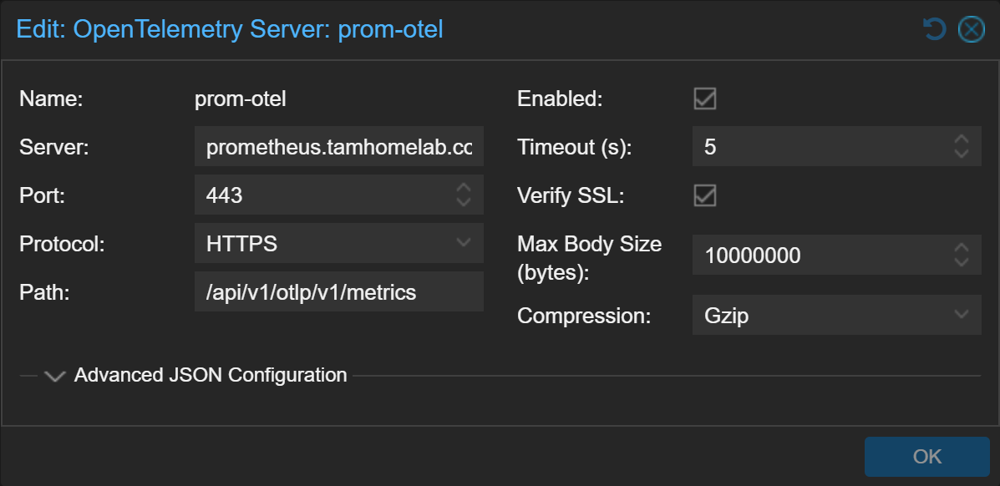
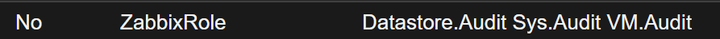
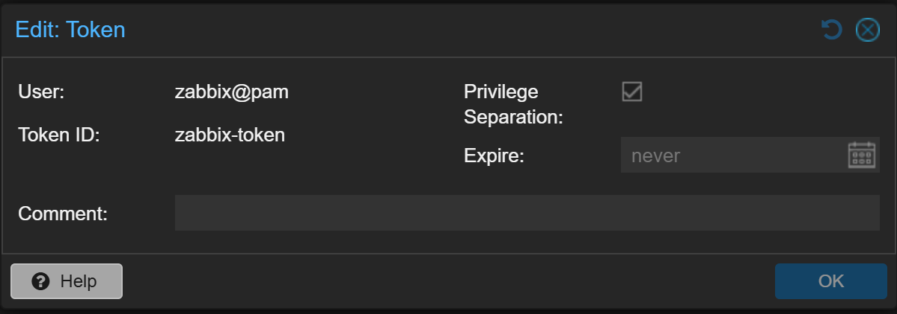
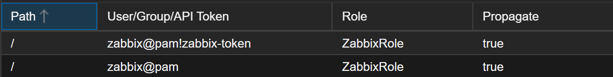
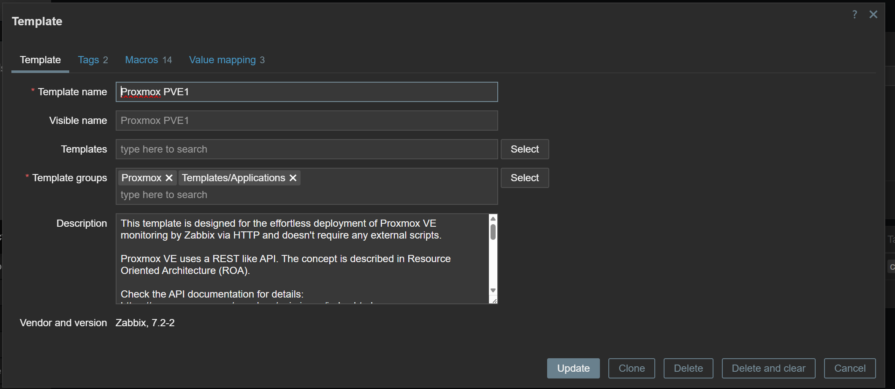
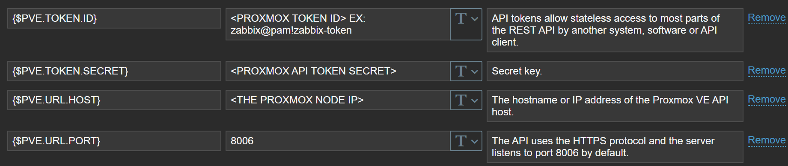
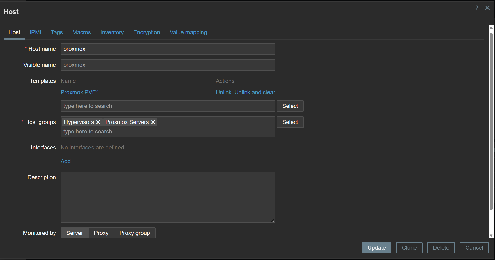
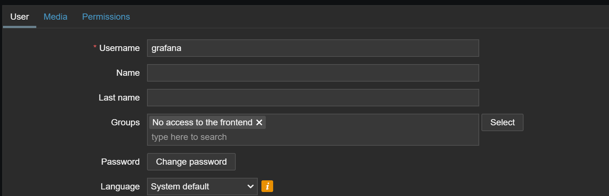
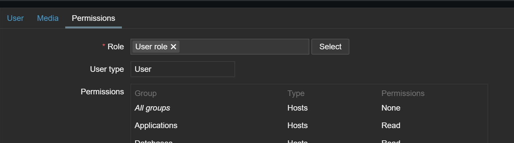

# Proxmox Monitoring

## Via OpenTelemery (Proxmox VE >=9)

With **Proxmox VE 9**, the **OpenTelemetry** integration was introduced as a native metrics server option. This allows Proxmox to export system and virtual machine performance data in a standardized telemetry format.

The implementation is straightforward:

- Enable OpenTelemetry Metrics Server in Proxmox:
  -  Navigate to Datacenter → Metrics Server → Add → OpenTelemetry
  - Configure the target endpoint (in this case, Prometheus).
  
  > **Note**: Leave the path as is, change the rest accordingly.

- Configure Prometheus as a OpenTelemetry backend ([docs](https://prometheus.io/docs/guides/opentelemetry/)):
  - Add the flag: `--web.enable-otlp-receiver`

- Visualize in Grafana:
  - Connect Grafana to Prometheus as a data source.
  - Example [dashboard](https://github.com/Tiagura/k8s-gitops/blob/main/monitoring/prometheus-stack/dashboards/proxmox-otel-dashboard.yaml)

## Via HTTP API with zabbix
Proxmox monitoring is done by querying the Proxmox REST API over HTTP. Zabbix collects these metrics and acts as a data source for Grafana, allowing the metrics to be visualized through dashboards. To enable this, you'll need to configure various things in Proxmox, Zabbix and Grafana.

### Proxmox Configuration

#### 1. Create a Custom Role

Go to: **Datacenter → Permissions → Roles → Create**

- **Role Name**: `ZabbixRole` (or any name)
- **Permissions**:
  - `Sys.Audit`
  - `Datastore.Audit`
  - `VM.Audit`
 

#### 2. Create a New User

Go to: **Datacenter → Permissions → Users → Add**

- **User**: `zabbix@pam`  
- Use `pam` as the authentication realm

#### 3. Create an API Token

Go to: **Datacenter → Permissions → API Tokens → Add**

- Associate the token with the `zabbix@pam` user
- Enable the option `Privilege Separation` (optional but recommended)
- Create the token and copy/store the **Secret**, you will not be able to see it again

  

#### 4. Assign Role and Token

Go to: **Datacenter → Permissions**

- Add new permission entries like in the image:

  

> Reference: [Proxmox Forum Discussion](https://forum.proxmox.com/threads/zabbix-template-proxmox-ve-by-http-not-working-to-provide-data.116316/)

### Zabbix Configuration

Once Proxmox is set up to expose its API (see previous section), you need to configure Zabbix to collect and visualize these metrics.

#### 1. Create a Template Group

Go to: **Data Collection → Template Groups → Create template group**

- **Name**: `Proxmox`

#### 2. Import the Proxmox Template

Use the official [Zabbix Proxmox Integration](https://www.zabbix.com/integrations/proxmox).

- Download the Proxmox template file from Zabbix GitHub:  
  [template_app_proxmox.yaml](https://github.com/zabbix/zabbix/blob/master/templates/app/proxmox/template_app_proxmox.yaml)

- Follow this Zabbix documentation to import the template:  
  [How to import templates](https://www.zabbix.com/documentation/7.2/en/manual/xml_export_import/templates#importing)

##### Proxmox Templte Configuration:
- Add the `Proxmox` template group if not already assigned
- Edit the template's **Macros**, if not done before, to match your environment (e.g., API token, node names)

  
  

**Note:** You need to import a **separate template for each Proxmox node** you want to monitor, you can use the same created token api but the templates need to be diferent.

#### 3. Create and Link Host

Go to: **Data Collection → Hosts → Create host**

- **Host Name**: Must exactly match the node name in Proxmox (e.g., `PVE1`)
- **Templates**: Link the correct Proxmox template
- **Groups**: `Hypervisors` and `Proxmox Servers`

> If these host groups don’t exist, you can create them.

#### 4. Create a user for Grafana

Go to: **Users → Users → Create user**

- **Username**: grafana (if you change it, also change it in the grafana zabbix datasource)
- **Password**: give it one
- **Groups**: No access to frontend
- **Role**: User role

### Grafana Configuration

Grafana integrates Zabbix as a data source to retrieve and visualize Proxmox metrics, using the [official Zabbix plugin for Grafana](https://grafana.com/grafana/plugins/alexanderzobnin-zabbix-app/).

####  Components

The following components are needed:

- **Plugin**: [Zabbix Plugin](https://grafana.com/grafana/plugins/alexanderzobnin-zabbix-app/) (must be instaled and enabled manually)
- **Data Source**: [`Zabbix`](https://github.com/Tiagura/k8s-gitops/blob/main/monitoring/prometheus-stack/datasources/zabbix-datasource.yaml)
- **Dashboard**: [`Proxmox Info Dashboard`](https://github.com/Tiagura/k8s-gitops/blob/main/monitoring/prometheus-stack/dashboards/proxmox-dashboard.yaml)

> Update the `datasources.yaml` to reflect your actual Zabbix server setup (URL, access, credentials).

## Grafana Provision

Dashboards and Datasources can be manually created or provisioned automatically (see [Grafana Provisioning docs](https://grafana.com/docs/grafana/latest/administration/provisioning/)).