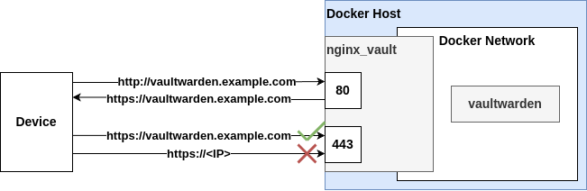
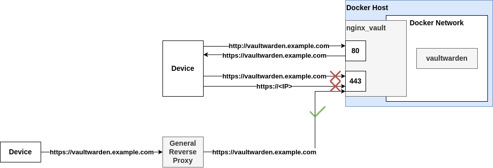

# Vaultwarden Setup

This folder contains the configuration files, scripts, and SSL certificates for setting up and managing a [Vaultwarden](https://github.com/dani-garcia/vaultwarden) instance. The service is deployed with [Nginx](https://nginx.org/) as a reverse proxy, ensuring that Vaultwarden is only accessible through this proxy.

---

## Folder Structure


```
├── docker-compose.yaml		
├── logs
│   └── nginx/			# Nginx log files
├── nginx.conf			# Nginx Configuration
├── scripts			
│   ├── backup_vault.sh		# Backup to cloud automation script
│   ├── log/
│   └── setup.sh		# Script to install needed tools for backup
└── ssl/            # Folder for certificates
```

## Reverse Proxy

Vaultwarden is deployed with Nginx as a reverse proxy, ensuring it is only accessible through the specified domain and not by the server's IP address. Any requests with an incorrect `Host` header are blocked with a `403 Forbidden` error. The configuration also enforces secure HTTPS access, restricting Vaultwarden to the specified domain only.

The **Nginx configuration** used is based on the example provided in the [Vaultwarden Proxy Examples Wiki](https://github.com/dani-garcia/vaultwarden/wiki/Proxy-examples). This configuration allows you to securely access your Vaultwarden instance through a domain name.

## Reverse Proxy

Vaultwarden is deployed with Nginx as a reverse proxy, ensuring it is only accessible through the specified domain and not by the server's IP address. Any requests with an incorrect `Host` header are blocked with a `403 Forbidden` error. The configuration also enforces secure HTTPS access, restricting Vaultwarden to the specified domain only.



The **Nginx configuration** used is based on the example provided in the [Vaultwarden Proxy Examples Wiki](https://github.com/dani-garcia/vaultwarden/wiki/Proxy-examples). This configuration allows you to securely access your Vaultwarden instance through a domain name.

To increase security or if you have a general reverse proxy for your services, change the following lines to the `nginx.conf` file under the appropriate location block:

***
allow <general_reverse_proxy_ip>;
deny all;
***

This ensures that only the general reverse proxy server can communicate with the local nginx and therefore the vaultwarden service.



>**Note**: If your setup includes only a local reverse proxy ([image](images/localproxy.png)), you must remove these lines to allow your devices to access Vaultwarden.

### Accessing Vaultwarden

Per my configuration, Vaultwarden can only be accessed using a domain like:

`vaultwarden.example.com`

To use your different domain name, you need to update the `DOMAIN` variable in the `docker-compose.yml` file and modify the `nginx.conf` file. Specifically, change the `server_name` directive and any other occurrences of the domain name to reflect your desired domain.

### SSL Certificates

Nginx is configured to use **self-signed certificates** for HTTPS. These certificates must be placed in the `ssl/` folder inside the Vaultwarden directory, with the names of the certificate and the key being `vaultwarden.crt` and `vaultwarden.key` by default.

The default Nginx configuration points to these files:

```
ssl_certificate /etc/nginx/ssl/vaultwarden.crt;
ssl_certificate_key /etc/nginx/ssl/vaultwarden.key;
```

If you use different names for your certificate and key files, you will need to update these paths in the nginx.conf file to reflect the new names.

### Self-Signed Certificate Generation

If you do not already have SSL certificates, you can generate a self-signed certificate and key using OpenSSL. To do so, follow these steps:

1. Navigate to the `ssl/` directory within your Vaultwarden setup:

    ```bash
    cd /root/vaultwarden/ssl
    ```

2. Run the following OpenSSL command to generate the certificate and private key:

    ```bash
    openssl req -new -x509 -sha256 -days 365 -keyout vaultwarden.key -out vaultwarden.crt -nodes
    ```

    - This will generate a `vaultwarden.crt` (certificate) and `vaultwarden.key` (private key) in the `ssl/` directory.
    - The `-days 365` option will make the certificate valid for one year, but you can adjust this as needed.
    
> **Note**: If you follow this the private key is unencrypted. This is usefull in a reverse proxy with SSL certificates using Docker, where entering a passphrase each time the service starts would be inconvenient.

3. When prompted, provide the necessary details for the certificate, such as country, state, and organization. The `Common Name` should match the domain you'll be using for Vaultwarden.

4. Once generated, make sure the certificate and key files are placed in the `ssl/` directory, and update the paths in the `nginx.conf` file if necessary.

### Let's Encrypt Certificates

Instead of self-signed certs, the usage of [Let's Encrypt](https://letsencrypt.org/) can also be done. However, the nginx.conf file needs to be modified for this. Search the internet for this.
 
## Backup Vaultwarden

### Required Tools for Backup

To back up your Vaultwarden instance, you will need to have the following tools installed:

- **[sqlite3](https://www.sqlite.org/download.html)**
- **[rclone](https://rclone.org/downloads/)**
- **[zip](https://infozip.sourceforge.io/)**

These tools are essential for performing the backup process, compressing the data, and uploading it to remote storage. You can install them by running the setup script provided (`scripts/setup.sh`).

### Backup Process

The backup process for Vaultwarden is based on the guidelines provided in the [Vaultwarden Wiki: Backing Up Your Vault](https://github.com/dani-garcia/vaultwarden/wiki/Backing-up-your-vault). The backup is managed by a script, (`scripts/backup_vault.sh`), that automates the following steps:

1. **Stop the Vaultwarden Docker container** to ensure data consistency during the backup.
2. **Back up the data directory**, which contains all the important Vaultwarden data.
3. **Zip the backup** to compress the data, making it easier to store and transfer.
4. **Send the backup to storage** (in this case, Google Drive) using **rclone**.
5. **Keep only the latest 3 backups** on the remote storage. Older backups are deleted automatically.  
   You can adjust this behavior in the script to retain more or fewer backups as needed.
6. **Starts the Vaultwarden Docker container**

### Google Drive Integration with rclone

The backup in this setup is configured to upload to **Google Drive**. To enable rclone to interact with Google Drive, follow the configuration guide provided at [Rclone Google Drive Setup](https://rclone.org/drive/), additionally **a client ID** is required. You can create your own client ID by following the instructions at [Creating your own rclone client ID](https://rclone.org/drive/#making-your-own-client-id).

For other storage options and configuration, please refer to the [Rclone Overview](https://rclone.org/overview/) for more details on how to set up and use other cloud services.

### Backup Script Configuration

To use the backup script for Vaultwarden, you need to configure several variables within the script to match your environment. Below are the variables that need to be adjusted before running the backup:

1. **`VAULTWARDEN_PATH`**:  
   This variable defines the path to the **Vaultwarden main directory**. Make sure to set it to the correct location of your Vaultwarden installation.
   ```bash
   VAULTWARDEN_PATH="/root/vaultwarden/"
   ```

2. **`VAULTWARDEN_DATA`**:  
   This variable defines the folder where all data related to vaultwarden is stored. By default this folder is caled **data**m defined in the docker-compose.yaml file. If you changes it make sure to set it to the correct location of your Vaultwarden installation.
   ```bash
   VAULTWARDEN_DATA="./data"
   ```
   
3. **`REMOTE_NAME`**:  
   This variable represents the rclone remote name configured for your storage (e.g., gdrive, dropbox, etc.). Replace "remote" with the name of your rclone remote.
   ```bash
   REMOTE_NAME="remote"
   ```
   
4. **`REMOTE_NAME`**:  
   Set this to the path where you want the backup to be stored in your cloud storage. This could be something like backups/vaultwarden or any other directory structure you prefer.
   ```bash
   REMOTE_PATH="backups/vaultwarden"
   ```
   
5. **`VAULTWARDEN_CONTAINER`**:  
   This variable holds the name of your Vaultwarden Docker container. If your container is named differently, change "vaultwarden" to the appropriate name.
   Note: If the container is not stopped during the backup process, the backup may not capture all data, as some files may be in use or locked. It is recommended to stop the container to ensure a consistent backup.
   ```bash
   VAULTWARDEN_CONTAINER="vaultwarden"
   ```

6. **`ZIP_PASSWORD`**:  
   This variable sets the password used to encrypt the backup ZIP file. Make sure to choose a strong, secure password.
   ```bash
   ZIP_PASSWORD="your-secure-password"
   ```
   
### Automating the Backup Process

To ensure that your Vaultwarden backup happens regularly, you can automate the process by creating a **cron job**. This will run the backup script at a specified interval, such as daily or weekly, without manual intervention.

#### Setting up a Cron Job

1. Open the **crontab** configuration by running the following command:
   ```bash
   crontab -e
   ```
   
2. Add a new line to schedule the backup. For example, to run the backup script every day at 7:00 AM, add the following line:
   ```bash
   0 7 * * * /root/vaultwarden/scripts/backup_vault.sh >> /root/vaultwarden/scripts/log/backup_vault.log 2>&1
   ```
